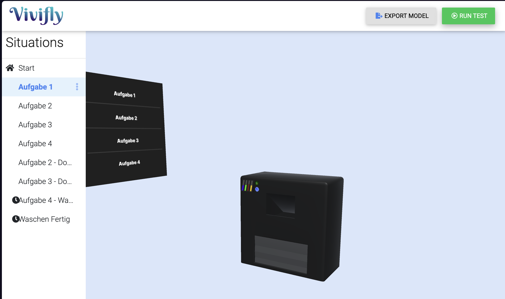
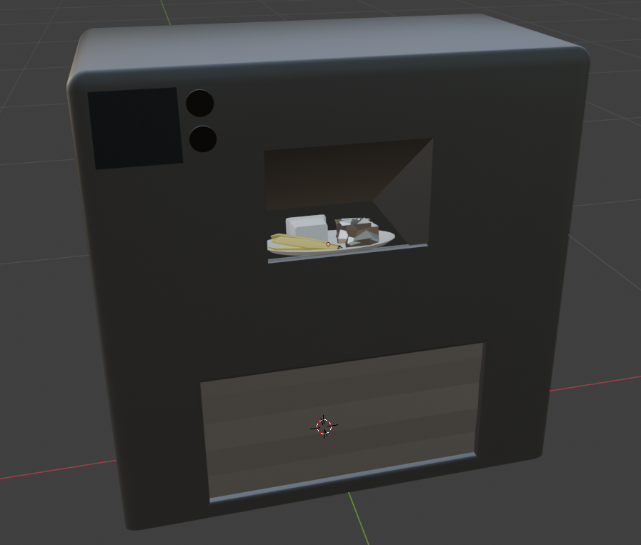
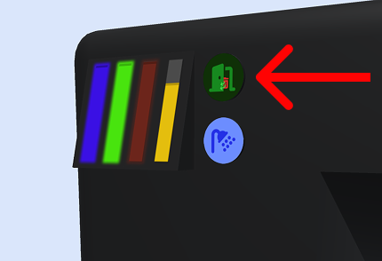
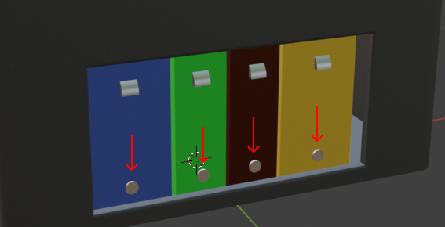
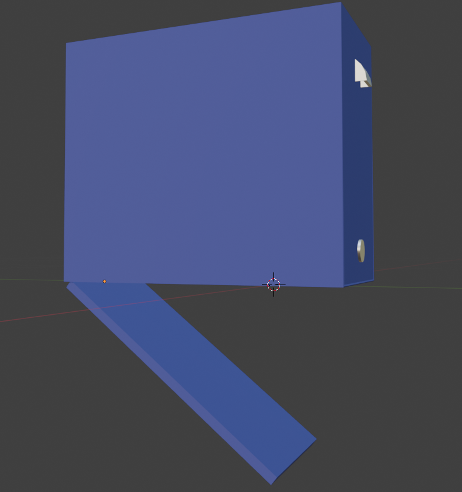
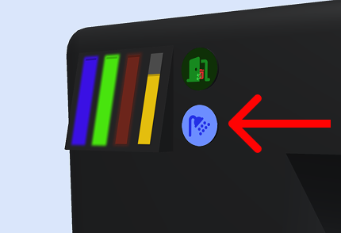

# "Mülltrenner" Prototype 

## Structure 
Die Repository enthält:
- `muelltrenner-model.blend` - das Modell des Prototypen
- `garbage-models` - Müll (ein zusammengesetztes Müllmodel mit Papier, Plastik und Restmüll) und Mülltonnen für die Aufgaben 2 und 3.
- `assets` - unterschiedliche Zustände des Displays und Buttons
- `exported` - alle Modelle im `.fbx` Format
- `Vivifly Model` - das exportierte Model aus Vivifly mit Konfiguration von Situations (siehe "Situations"-Sektion)

## Situations
- Es gibt 4 Aufgaben für den Test und entsprechend 4 Startzustände für die Aufgaben (siehe `assets/screens`). 
- Links neben dem Prototypen ist ein Display mit der Auflistung der Aufgaben platziert. Das Display ist dafür da, dass die Proband:innen manuell zu nächsten Aufgabe weitergeleitet werden können, falls eine Aufgabe nicht erledigt werden konnte. 

**Wichtig:** wir wollen die Proband:innen nicht in ein bestimmtes Vorgehen lenken. Das linksstehende Display und die Definition von den Start-Situations für die Aufgaben sind lediglich dafür da, dass der Test weitergeführt werden kann auch wenn die vorherige Aufgabe nicht geklappt hat.

Das Display wurde in Vivifly für alle vorhandenen Situtations konfiguriert. **Wenn Sie neue Situations oder ähnliches erstellen, sorgen Sie bitte dafür, dass das Display in allen Situations  funktioniert.**

## Aufgaben / Functionalities
Hier ist die Auflistung der Aufgaben, die für den Usability Test relevant sind. Die Funktionalitäten, die in Vivifly nicht konfiguriert werden konnten, haben wir ___fettgeruckt und kursiv___ markiert. 

Damit man zu der Situation "Aufgabe 1" weitergeleitet wird, muss man auf dem linksstehenden Display auf "Aufgabe 1" drücken.
 
1. ___Müll einwerfen. Sobald das Müllmodell in den Mülltrenner landet, soll das Display folgende Zustände sequenziell je 1000 ms annehmen:___
    - `screens/paper.png`
    - `screens/bio.png`
    - `screens/plastic.png`
    - `screens/non-recyclable.png`

    ___Danach soll die Situation "Aufgabe 2" getriggert werden und Müll soll verschwinden.___

    

    Das Display zeigt jetzt, dass Rest-, Bio-, und Papier- Abteile voll sind (Zustand 2).

2. ___Restmüll leeren.___ Hier wird der obere Knopf zum Öffnen der Tür gedrückt. Dieser Knopf leitet die Szene in die Situation "Aufgabe 2 - Door Open". 

    
    
    ___Die Tür soll in dieser Situation geöffnet werden. Sie soll sich nach oben innerhalb des Mülltrenners falten.___
    
    ___Hier soll man die Compartments rausnehmen können. Beim Drücken auf den Button auf dem Compartment soll sich dieser nach unten öffnen.___

    ___Bitte benutzen Sie die beiden Zustände für die Buttons von Compartments `assets/buttons/open-compartment`. Diese Buttons konnten leider nicht in Vivifly konfiguriert werden, da sie innerhalb des Models liegen.___

    
    

    ___Bitte platzieren Sie die Mültonnen `exported/garbage-containers.fbx` für die Aufgabe 2 und 3 in die Szene.___

    An dieser Stelle möchten wir das Herausfallen des Mülls aus den Compartments vernachlässigen, da die Implementierung der Workflows bereits ohne diese Berücksichtigung recht komplex ist.

    ___Nach dem Wiedereinsetzen sollte das Compartment durch ein Snap-Verhalten an seine Ausgangsposition zurückspringen.___

    Danach wird auf den Tür-Button gedrückt und es wird zu der Situation "Aufgabe 3" weitergeleitet. ___Die Tür sollte zugemacht werden___

    Jetzt zeigt das Display, dass Papier- und Bio- Abteile voll sind. Restmüll-Abteil ist jetzt leer (Zustand 3).

3. ___Biomüll leeren.___ Technisch das gleiche, wie bei der vorgerigen Aufgabe. Nach dem Wiedereinsetzen von dem Compartment wird auf den Tür-Button gedrückt und es wird zu der Situation "Aufgabe 4" weitergeleitet. ___Die Tür sollte zugemacht werden___

    Jetzt zeigt das Display, dass ledeglich Papier-Abteil voll ist. Rest- und Bio- Abteile sind jetzt leer (Zustand 4).

4. Auswaschen. Hier wird auf den Waschen-Button gedrückt und es wird zu der Situation "Aufgabe 4 - Waschen" weitergeleitet. Nach 8000ms wird es zu der Situation "Waschen fertig" weitergeleitet und dann nach 4000ms wieder zu der Situation "Aufgabe 4".

    

Für das Reset wird der linksstehende Screen benutzt. ___Wir bitten Sie dafür zu Sorgen, dass alle Elemente des Prototypen auf die Ausgangspositionen positioniert werden, wenn man auf dem Display eine Aufgabe auswählt.___

## Zusammenfassung der notwendigen Ergänzungen
1. Das Müllmodell sowie die Mülltonnen sollen zusätzlich in der Szene platziert werden.
2. Triggger beim Mülleinwerfen => Display Feedback => Zustand 2
3. Das grüne Button mit dem Tür Symbol soll das Öffnen der Tür triggern.
4. Compartments soll man rausnehmen können und wieder einsetzen könenn (Snapping auf die Ursprungsposition).
5. Buttons auf den Compartments sollen die Zustände annehmen `assets/buttons/open-compartment`.
6. Compartments soll man durch das Klicken auf die Buttons öffnen können.
7. Aufgabe 2 => Tür zu (Durch das erneute Klicken auf den Tür-Button) => Trigger für Zustand 3 
8. Aufgabe 3 => Tür zu (Durch das erneute Klicken auf den Tür-Button) => Trigger für Zustand 4
9. Alle Elemente des Mülltrenners sollen resetet werden, wenn man auf die Aufgaben klickt.

## Thank you
Die oben genannten Funktionalitäten beschreiben den angestrebten Funktionsumfang für den Usability-Test. 

Uns ist bewusst, dass aufgrund des engen Zeitrahmens möglicherweise nicht alle Punkte vollständig umgesetzt werden können. 

**Vielen Dank für Ihre Unterstützung! 🤩**